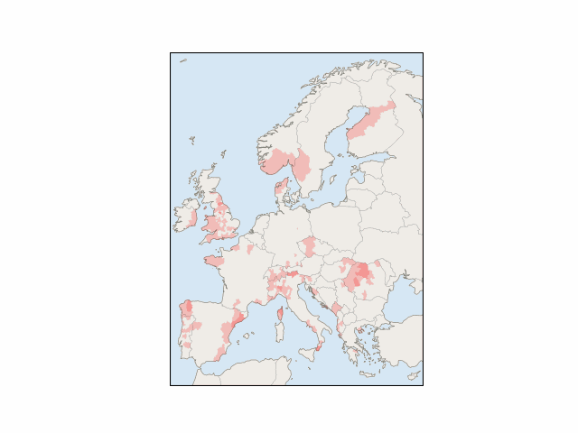
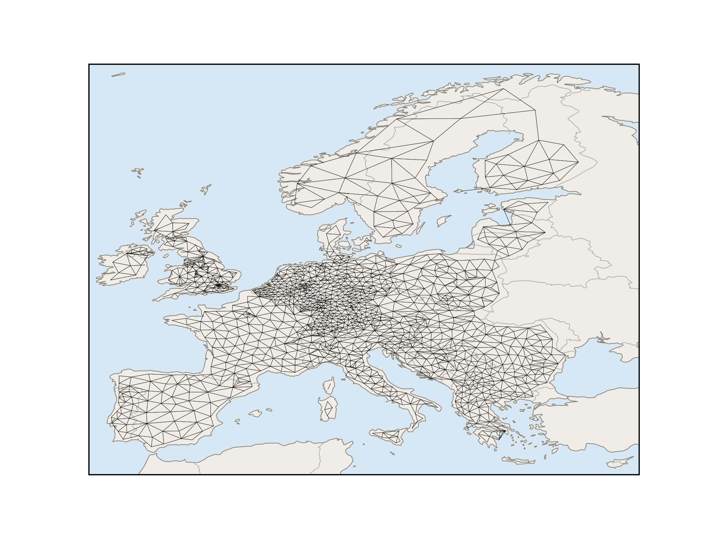

# 🌊 HANZE analyitics 🌊
<table>
  <tr>
    <td align="center">
      <b style="font-size:16px;">Cummulative reported area</b> 
       
    </td>
    <td align="center">
      <b style="font-size:16px;">Yearls reported area</b> 
       
    </td>
  </tr>
</table>

  <b style="font-size:16px;">Adjacency Graph</b> 
  

