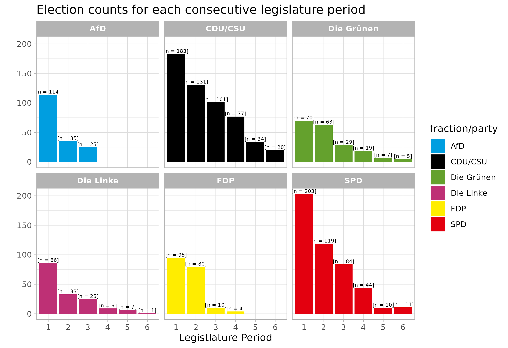

# 🏛️survote🏛️
  

## Intro
This project models the re-election of Members of the German Bundestag using survival analysis. A panel dataset of MPs is combined with individual- and constituency-level covariates to estimate re-election probabilities and career duration.
  

  

### 🙏Acknowledgements
I would like to thank [Abgeordnetenwatch](https://www.abgeordnetenwatch.de/api) for providing a convenient API and data resource which tremendously simplified gathering necessary data on parliarmentary voting records.